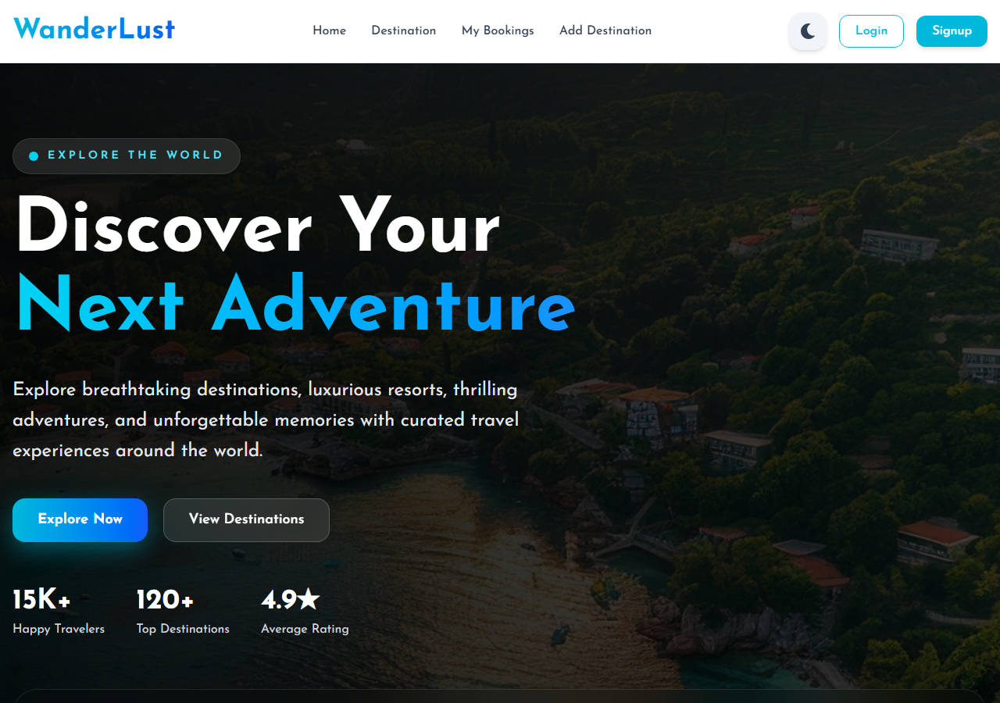
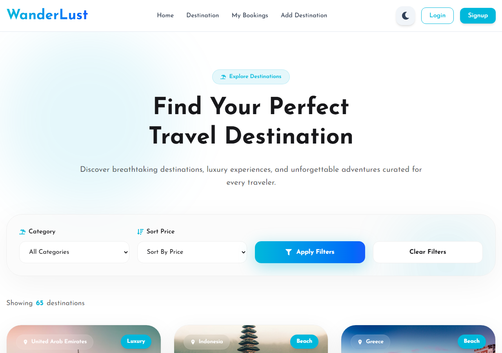
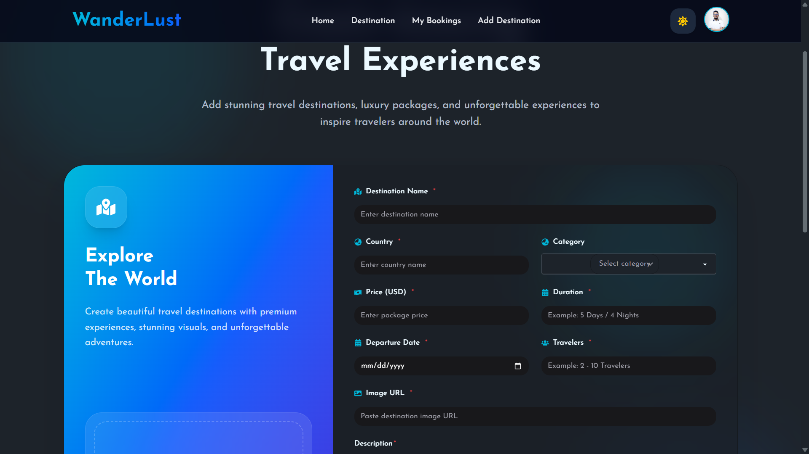
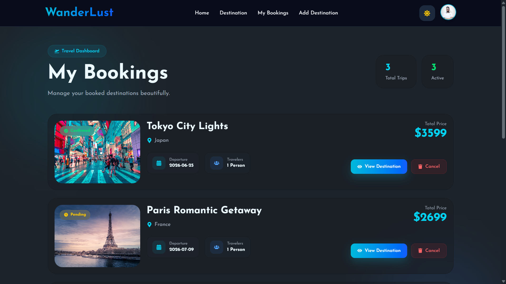
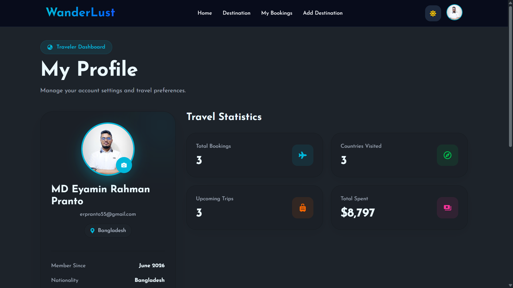
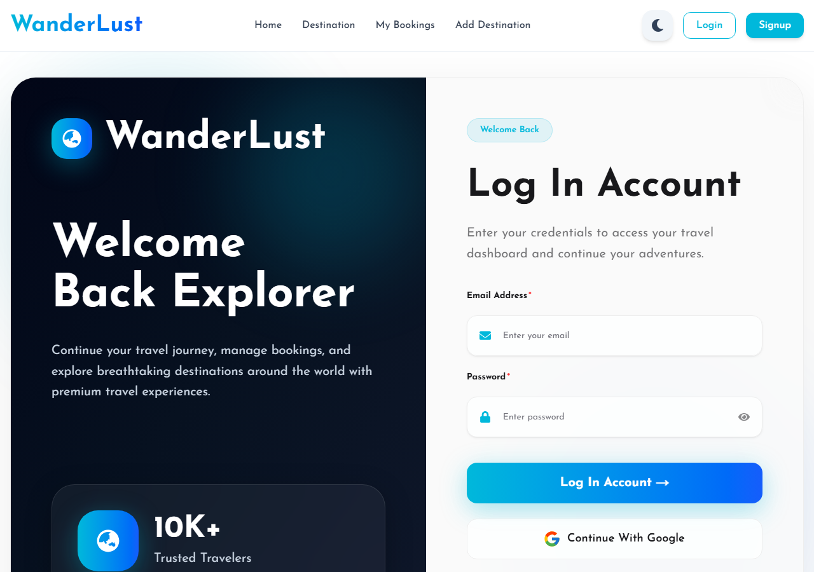
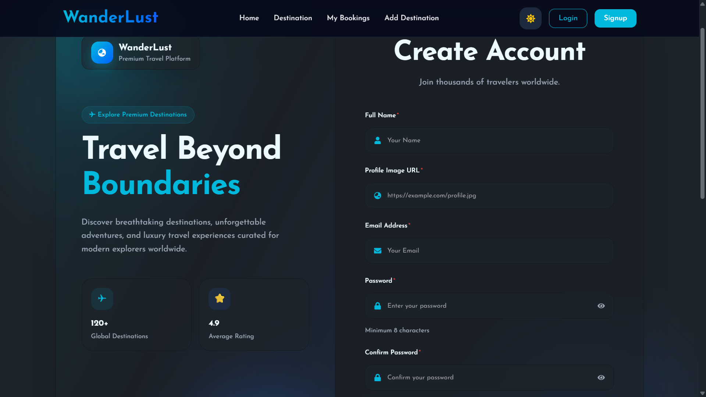

<div align="center">

# Wanderlust

**A full-stack travel destination platform** — browse curated worldwide destinations, filter by category and budget, book trips, and manage your reservations in one place.

[](https://nextjs.org/)
[](https://react.dev/)
[](https://www.mongodb.com/)
[](https://tailwindcss.com/)
[](LICENSE)

[Live Demo](https://wanderlust-ten-psi.vercel.app/) ·
[Server Repository](https://github.com/erpranto55/Wanderlust-server) ·
[Report Bug](https://github.com/erpranto55/Wanderlust/issues) ·
[Request Feature](https://github.com/erpranto55/Wanderlust/issues) ·


</div>

---

## About

Wanderlust is a curated travel marketplace where users can discover handpicked experiences — from luxury Santorini escapes to Bali tropical retreats — filter by category, duration, and budget, and manage their own bookings. Hosts can add destination listings directly through the platform, and authenticated users can leave verified reviews.

Built with **Next.js 16 App Router**, **MongoDB**, **Better Auth**, **Tailwind CSS v4**, and **DaisyUI v5** — deployed on **Vercel**.

---

## Screenshots

<div align="center">

### 🏠 Homepage


### 🗺️ Destinations


### ➕ Add Destination


### 📅 My Bookings


### 👤 Profile


### 🔐 Login


### 📝 Sign Up


</div>

---

## Features

- **Authentication** — Secure sign-up and login via Better Auth, with protected routes for booking and listing management.
- **Destination Discovery** — Browse curated worldwide listings with photos, pricing, duration, and capacity.
- **Search & Filtering** — Filter by location, trip duration, budget, and number of travellers in real time.
- **Category Browsing** — Explore by Beach, Mountain, Luxury, Adventure, City, or Cultural categories.
- **Destination Detail Pages** — Full descriptions, ratings, review counts, available dates, and booking options.
- **Booking Management** — Book trips and view all reservations in a personal My Bookings dashboard.
- **Add Destination** — Logged-in users can submit new travel destinations via a simple form.
- **Reviews & Ratings** — Star ratings and verified traveller reviews on each listing.
- **Responsive UI** — Mobile-first design using Tailwind CSS v4 and DaisyUI v5.

---

## Tech Stack

**Frontend:** Next.js 16.2.6, React 19.2.4, Tailwind CSS v4, DaisyUI v5, HeroUI v3, React Icons, React Toastify

**Backend:** Next.js API Route Handlers (serverless), Better Auth v1.1

**Database:** MongoDB v7.2, MongoDB Atlas

**Tooling:** ESLint, PostCSS, Vercel

---

## Directory Structure

```
Wanderlust/
├── public/
│   └── assets/                  # Static assets
├── src/
│   ├── app/
│   │   ├── layout.js            # Root layout
│   │   ├── page.js              # Homepage
│   │   ├── destination/
│   │   │   ├── page.js          # All destinations
│   │   │   └── [id]/page.js     # Destination detail
│   │   ├── add-destination/
│   │   │   └── page.js          # Add listing form (protected)
│   │   ├── my-bookings/
│   │   │   └── page.js          # Bookings dashboard (protected)
│   │   ├── login/page.js
│   │   ├── signup/page.js
│   │   └── api/
│   │       ├── auth/            # Better Auth endpoints
│   │       └── destinations/    # CRUD endpoints
│   ├── components/              # Reusable UI components
│   ├── lib/
│   │   ├── mongodb.js           # DB connection helper
│   │   └── auth.js              # Auth configuration
│   └── models/                  # MongoDB schemas
├── .env.local
├── next.config.mjs
└── package.json
```

---

## Getting Started

### Prerequisites

- Node.js >= 18.x
- npm >= 9.x
- A [MongoDB Atlas](https://www.mongodb.com/cloud/atlas/register) account

### Installation

```bash
# 1. Clone the repo
git clone https://github.com/erpranto55/Wanderlust.git
cd Wanderlust

# 2. Install dependencies
npm install

# 3. Set up environment variables (see below)
cp .env.example .env.local

# 4. Start the development server
npm run dev
```

Open [http://localhost:3000](http://localhost:3000) in your browser.

```bash
# Build for production
npm run build
npm run start
```

---

## Environment Variables

Create a `.env.local` file in the project root. **Never commit this file.**

```env
# MongoDB Atlas connection string
MONGODB_URI=mongodb+srv://<username>:<password>@cluster0.xxxxx.mongodb.net/wanderlust?retryWrites=true&w=majority

# Random secret for signing session tokens (run: openssl rand -hex 32)
BETTER_AUTH_SECRET=your_secret_here

# Canonical URL of your app
BETTER_AUTH_URL=http://localhost:3000

# Public base URL
NEXT_PUBLIC_BASE_URL=http://localhost:3000
```

For production, add these same keys in your Vercel project under **Settings → Environment Variables**.

---

## Contributing

1. Fork the repository
2. Create a feature branch: `git checkout -b feature/your-feature`
3. Commit your changes: `git commit -m 'feat: add your feature'`
4. Push to the branch: `git push origin feature/your-feature`
5. Open a Pull Request against `main`

Please keep PRs focused (one feature or fix per PR), follow the existing code style, and open an issue first for major changes.
